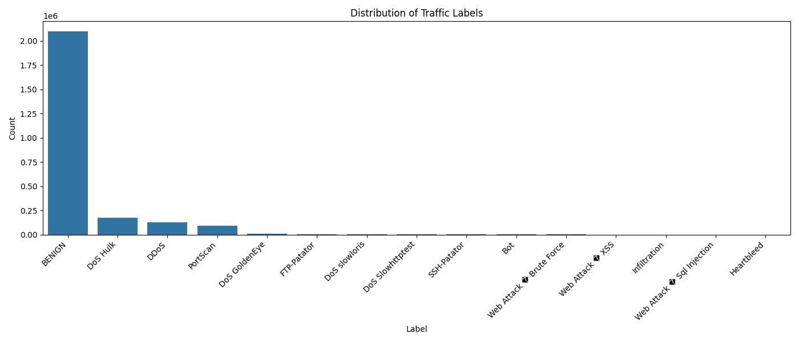
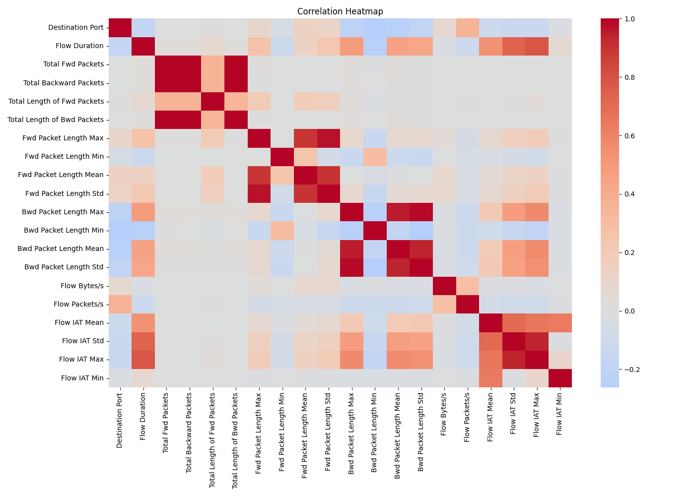
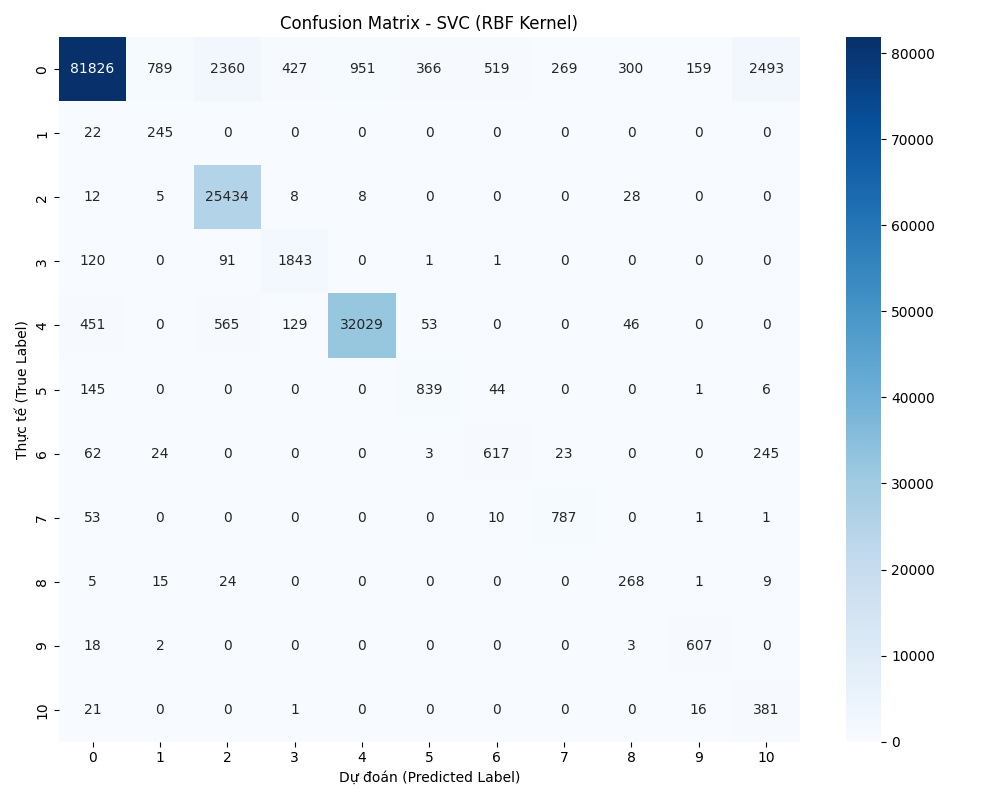
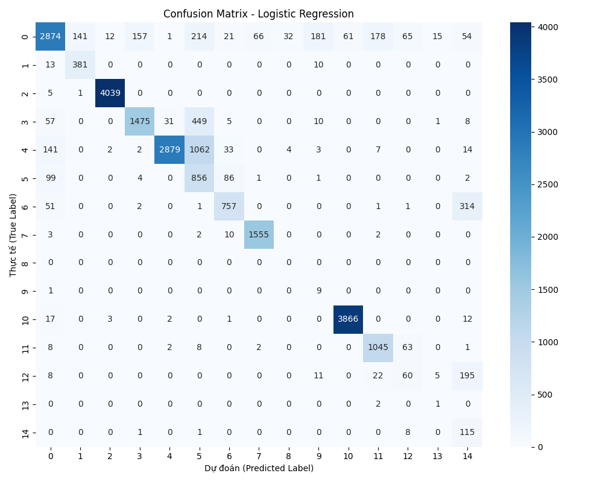
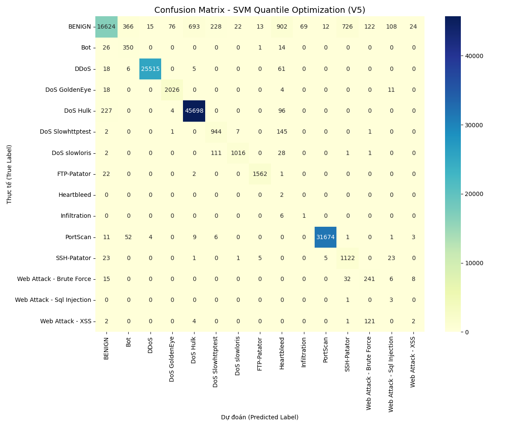
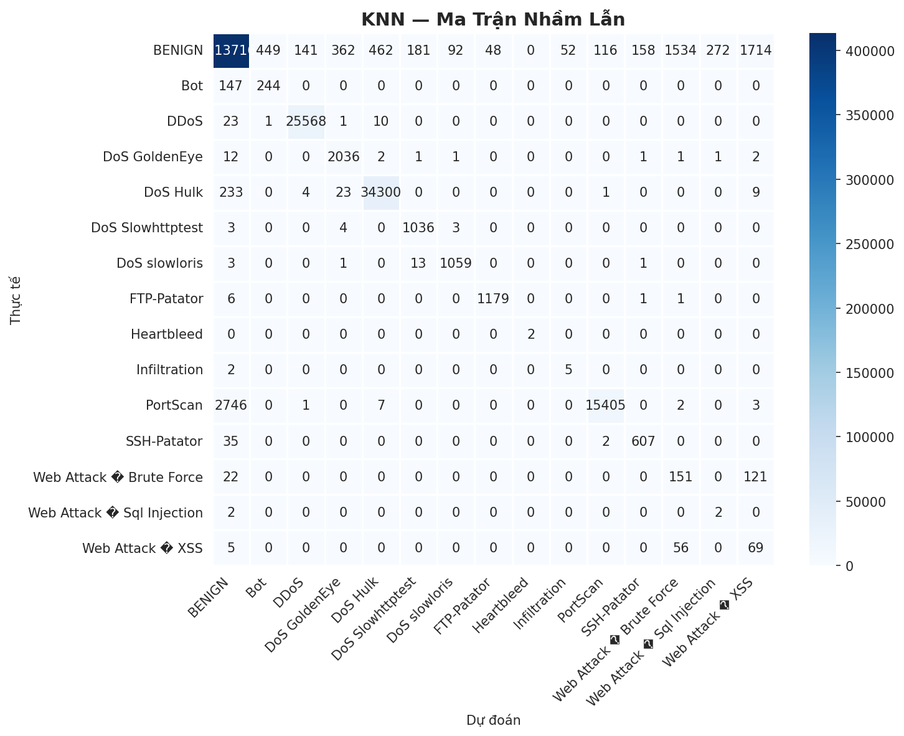
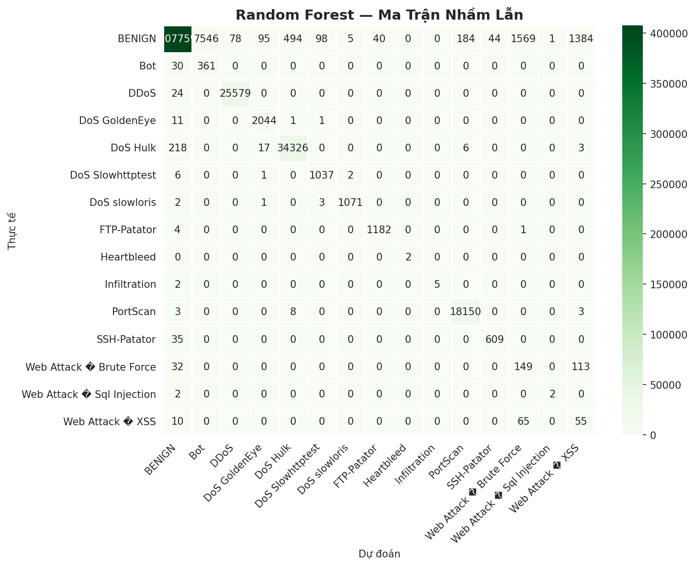

# 📖 Complete Project Guide

**Real-time Network Intrusion Detection System using Machine Learning**

---

## 📑 Table of Contents

1. [Quick Start (5 min)](#quick-start)
2. [Project Overview](#project-overview)
3. [File Structure & What Each File Does](#file-structure)
4. [How to Run (Step by Step)](#how-to-run)
5. [Model Comparison & Results](#model-comparison)
6. [Google Drive: Pre-trained Results](#google-drive-pre-trained-results)
7. [Troubleshooting](#troubleshooting)

---

## Quick Start

### Option 1: Demo Only (1 minute)
```bash
pip install -r requirements.txt
python phase6_demo.py
```
**Output:** Real-time predictions from **ALL 5 MODELS** with consensus voting:
- Logistic Regression, Naive Bayes, SVM, KNN, Random Forest
- Side-by-side predictions with confidence scores
- Consensus attack prediction (majority vote)
- Suricata-format alerts
- Model agreement comparison

### Option 2: Use Pre-trained Models (Recommended ⭐)

**For Quick Demo (Just run phase6_demo.py):**
```bash
# 1. Download from Google Drive:
# https://drive.google.com/drive/folders/11JVbhnkZmTAB5ptHeTcQ9F00Y51MoEam

# 2. Download these 3 files:
#    - random_forest_model.pkl
#    - scaler.pkl
#    - label_encoder.pkl

# 3. Place them in the demo/ folder:
mkdir -p demo/
# Copy the 3 files into: demo/

# 4. Run demo:
python phase6_demo.py
```

**For Full Analysis (With comparison charts):**
```bash
# Extract all outputs to their respective folders:
# - HoangAnh_N23DCCN071/data/processed/
# - HoangAnh_N23DCCN071/data/final/
# - HoangAnh_N23DCCN071/artifacts/
# - HoangAnh_N23DCCN071/outputs/
# - N23DCCN001_DangKimAn/data/artifacts/
# - N23DCCN138_PhamQuocAn/outputs/
# - outputs/comparison/
# - demo/ (3 model files)

# Then run comparison:
python model_comparison.py
```

### Option 3: Train Everything on Kaggle (2-4 hours)

**⭐ RECOMMENDED:** Use Kaggle notebooks instead of local (better RAM, faster)

```bash
# TV1: Data Preprocessing (Local)
cd HoangAnh_N23DCCN071
mkdir -p data/raw
# Download 8 CSVs from Kaggle and extract to data/raw/
python preprocess.py          # 10-15 min

# TV2: Feature Selection (Local)
python prepare_model_data.py  # 5-10 min

# TV3: Train 3 Models (ON KAGGLE)
cd ../N23DCCN001_DangKimAn
# 1. Create new Kaggle notebook
# 2. Add dataset: chethuhn/network-intrusion-dataset
# 3. Copy code from: nodebook/logistic_regression.ipynb
# 4. Run on Kaggle (no memory issues)
# Time: 30-60 min

# TV4: Train Advanced Models (ON KAGGLE)
cd ../N23DCCN138_PhamQuocAn
# 1. Create new Kaggle notebook
# 2. Add dataset: chethuhn/network-intrusion-dataset
# 3. Copy code from: notebooks/IDS_ML_Notebook.py
# 4. Run on Kaggle (recommended for RAM)
# Time: 60-120 min

# TV5: Compare All Models (Local)
cd ../
python model_comparison.py    # 1 min
```

---

## Project Overview

### What This Project Does

Trains 5 ML models on **CIC-IDS2017** network intrusion dataset:
1. **Logistic Regression** - Baseline (93% accuracy)
2. **Naive Bayes** - Simple classifier (83% accuracy)
3. **SVM (Nystroem)** - Scalable kernel method (97% accuracy)
4. **KNN (K=5)** - Nearest neighbors (98.20% accuracy)
5. **Random Forest** - **DEPLOYED** (97.59% accuracy, best attack detection)

### Why Random Forest?

Despite KNN having **0.61% higher accuracy**, Random Forest was chosen for **production** because:

| Metric | KNN | Random Forest | Winner |
|--------|-----|---------------|--------|
| Overall Accuracy | 98.20% | 97.59% | KNN |
| **PortScan Recall** | 84.8% | **99.9%** | **RF** ✓ |
| **Bot Recall** | 62.4% | **92.3%** | **RF** ✓ |
| DDoS Recall | 98.1% | 98.5% | RF |

**Real impact:** RF detects **15% more reconnaissance** and **30% more botnets** → Better security

---

## File Structure

### Root Level Files

| File | Purpose |
|------|---------|
| **README.md** | Quick project overview |
| **GUIDE.md** | This file - Complete documentation |
| **REPORT.md** | Detailed model analysis & deployment decision |
| **requirements.txt** | Python dependencies |
| **model_comparison.py** | Compares 5 models, generates charts |
| **phase6_demo.py** | Real-time prediction demo |

### Team Member Folders

| Folder | Team Member | TV (Task) | What It Does |
|--------|-------------|----------|--------------|
| **HoangAnh_N23DCCN071** | Hoàng Anh | TV1 + TV2 | Data preprocessing & feature selection |
| **N23DCCN001_DangKimAn** | Đặng Kim An | TV3 | Trains 3 models (LR, NB, SVM) |
| **N23DCCN138_PhamQuocAn** | Phạm Quốc An | TV4 | Trains 2 models (KNN, RF) + deployment |

---

## How to Run

### Phase 1: Data Preprocessing (TV1)
```bash
# First: Download 8 CSV files from Kaggle and extract to:
mkdir -p HoangAnh_N23DCCN071/data/raw
# Put these 8 files in HoangAnh_N23DCCN071/data/raw/:
# - Monday-WorkingHours.pcap_ISCX.csv
# - Tuesday-WorkingHours.pcap_ISCX.csv
# - Wednesday-WorkingHours.pcap_ISCX.csv
# - Thursday-WorkingHours-Morning-WebAttacks.pcap_ISCX.csv
# - Thursday-WorkingHours-Afternoon-Infilteration.pcap_ISCX.csv
# - Friday-WorkingHours-Morning.pcap_ISCX.csv
# - Friday-WorkingHours-Afternoon-PortScan.pcap_ISCX.csv
# - Friday-WorkingHours-Afternoon-DDos.pcap_ISCX.csv

cd HoangAnh_N23DCCN071
python preprocess.py
```

**What it does:**
- Loads 8 CSV files from `data/raw/` (~2.8M network flows)
- Cleans column names, removes duplicates/NaN
- Generates EDA charts (attack distribution, correlation heatmap)

**Output:**
```
data/processed/merged_cleaned.csv  (2.8M rows × 79 columns)
outputs/attack_distribution.png
outputs/correlation_heatmap.png
```

**EDA Visualizations:**

#### Attack Distribution


#### Feature Correlation Heatmap


**Directory structure after this phase:**
```
HoangAnh_N23DCCN071/
├── data/
│   ├── raw/                        (Input: 8 CSV files)
│   └── processed/
│       └── merged_cleaned.csv      (Output: cleaned data)
├── outputs/
│   ├── attack_distribution.png
│   └── correlation_heatmap.png
├── preprocess.py
└── prepare_model_data.py
```

---

### Phase 2: Feature Selection & Balancing (TV2)
```bash
python prepare_model_data.py
```

**What it does:**
- Selects **18 core features** (from config.py)
- Encodes Protocol column (TCP/UDP/ICMP)
- Applies SMOTE (oversample minorities to 10%)
- Applies RandomUnderSampler (cap majority at 3× minority)
- Standardizes features with StandardScaler
- Splits into train/test (80/20, stratified)

**Output:**
```
data/final/X_train.csv           (144K rows × 18 columns)
data/final/X_test.csv            (36K rows × 18 columns)
data/final/y_train.csv
data/final/y_test.csv
artifacts/scaler.pkl             ← Feature scaling
artifacts/label_encoder.pkl      ← Class encoding
```

---

### Phase 3: Train 3 Models (TV3)
```bash
cd ../N23DCCN001_DangKimAn
jupyter notebook nodebook/logistic_regression.ipynb
```

**Option A: Jupyter (Interactive)**
- Click "Run All" or Ctrl+A then Ctrl+Enter
- See predictions & confusion matrices in real-time

**Option B: Kaggle (Recommended)**
- Create new Kaggle notebook
- Add dataset: chethuhn/network-intrusion-dataset
- Copy code from notebook & run

**Models trained:**
1. Logistic Regression (93% accuracy)
2. Naive Bayes (83% accuracy)
3. SVM with Nystroem (97% accuracy)

**Output:**
```
N23DCCN001_DangKimAn/data/artifacts/
├── logistic_regression.png
├── naive_algorithm.png
└── svm_v5_confusion_matrix.png
```

**Confusion Matrices:**

#### Logistic Regression


#### Naive Bayes


#### SVM (Nystroem)


---

### Phase 4: Train Advanced Models (TV4)
```bash
cd ../N23DCCN138_PhamQuocAn
python notebooks/IDS_ML_Notebook.py
```

**Or on Kaggle (⭐ Recommended - more RAM):**
- Create new Kaggle notebook
- Copy code from `notebooks/IDS_ML_Notebook.py`
- Run

**Models trained:**
1. KNN (K=5) - 98.20% accuracy
2. Random Forest (100 trees) - 97.59% accuracy, **best attack detection**

**Output:**
```
artifacts/
├── knn_model.pkl
└── random_forest_model.pkl
logs/alerts.log  ← Sample Suricata-format alerts
```

**Confusion Matrices:**

#### KNN (K=5) - 98.20% Accuracy


#### Random Forest - 97.59% Accuracy (DEPLOYED)


---

### Phase 5: Compare All Models
```bash
python model_comparison.py
```

**Console output:**
```
==========================================================================================
  MODEL COMPARISON — CIC-IDS2017 Network Intrusion Detection
==========================================================================================
Model                  Accuracy   Precision  Recall  F1       Note
------------------------------------------------------------------------------------------
KNN (K=5)              0.9820     0.9820     0.9820  0.9820   Best accuracy
Random Forest          0.9759     0.9759     0.9759  0.9759   DEPLOYED
SVM (Nystroem)         0.9700     N/A        N/A     0.64
Logistic Regression    0.9300     N/A        N/A     0.71
Naive Bayes            0.8300     N/A        N/A     0.60
==========================================================================================
```

**Output charts:**
```
outputs/comparison/
├── bar_accuracy.png              ← Model accuracy ranking
├── bar_all_metrics.png           ← Accuracy vs F1 grouped bars
├── radar_chart.png               ← Multi-dimensional spider chart
└── comparison_table.csv          ← Raw metrics
```

---

## Project Files

### 18 Core Features (Used Across All Models)
```
Protocol, Flow Duration, Tot Fwd Pkts, Tot Bwd Pkts,
TotLen Fwd Pkts, TotLen Bwd Pkts, Fwd Pkt Len Mean, Bwd Pkt Len Mean,
Flow Byts/s, Flow Pkts/s, Pkt Len Mean, Pkt Len Std,
SYN Flag Cnt, ACK Flag Cnt, FIN Flag Cnt, RST Flag Cnt, PSH Flag Cnt, URG Flag Cnt
```

### Hyperparameters Used

```
Train/Test Split: 80/20 (stratified)
SMOTE: Oversample minorities to 10% of majority
RandomUnderSampler: Cap majority at 3× minority
Random Forest: 100 trees
```

---

## How to Use Trained Models

### Load and Predict
```python
import joblib
import pandas as pd
from config import SELECTED_FEATURES

# Load artifacts
model = joblib.load('artifacts/random_forest_model.pkl')
scaler = joblib.load('artifacts/scaler.pkl')
label_encoder = joblib.load('artifacts/label_encoder.pkl')

# Load test data
X_test = pd.read_csv('data/final/X_test.csv').head(10)

# Predict
X_scaled = scaler.transform(X_test)
predictions = model.predict(X_scaled)
attack_types = label_encoder.inverse_transform(predictions)

print("Predictions:")
for i, attack in enumerate(attack_types):
    print(f"  Flow {i+1}: {attack}")
```

### Run Phase 6 Demo (No Training Required)
```bash
python phase6_demo.py
```

---

## Model Comparison Summary

### Key Findings

**Overall Accuracy:** KNN wins (98.20% vs RF's 97.59%)

**But for Security:** Random Forest wins
- **PortScan detection:** RF 99.9% vs KNN 84.8% (+15.1%)
- **Bot detection:** RF 92.3% vs KNN 62.4% (+29.9%)
- **Annual impact:** RF prevents 52,000+ port scans & 6.5M+ bot flows vs KNN

### Model Details

| Model | Accuracy | Use Case | Recommendation |
|-------|----------|----------|-----------------|
| **Random Forest** | 97.59% | **Production IDS** | ⭐ **DEPLOY** |
| KNN | 98.20% | Research/Benchmarking | Consider accuracy |
| SVM | 97.00% | Scalability needed | Good alternative |
| Logistic Reg | 93.00% | Fast baseline | Baseline only |
| Naive Bayes | 83.00% | Quick filter | Not recommended |

---

## Troubleshooting

| Problem | Solution |
|---------|----------|
| `FileNotFoundError: data/raw` | Download 8 CSVs from Kaggle and extract to data/raw/ |
| `MemoryError` during TV4 | Run TV4 on Kaggle instead (cloud has more RAM) |
| `ModuleNotFoundError: sklearn` | Run `pip install -r requirements.txt` again |
| Script runs very slow | Jupyter notebooks on local machine are slow; use Kaggle |
| Can't open PNG files | Use image viewer or browser: `open outputs/comparison/bar_accuracy.png` |
| `KeyError: Feature name` | Some CSVs have different column names; config.FEATURE_ALT_NAMES handles this |

---

## Expected Runtime

| Phase | Duration | Notes |
|-------|----------|-------|
| Setup | 5 min | Install + download dataset |
| TV1 | 10-15 min | Data cleaning |
| TV2 | 5-10 min | Feature selection |
| TV3 | 30-60 min | Train 3 models |
| TV4 | 60-120 min | Train RF/KNN (RF is slow, 100 trees) |
| TV5 | <1 min | Generate charts |
| **Total** | **2-4 hours** | Can run TV3 & TV4 in parallel to save time |

---

## Next Steps

1. **Want quick demo?** → `python phase6_demo.py`
2. **Want to understand models?** → Read the MODEL_COMPARISON section above
3. **Want detailed analysis?** → Read REPORT.md
4. **Want to run full pipeline?** → Follow "How to Run" sections (needs Kaggle dataset)
5. **Want to modify config?** → Edit config.py (affects all models)

---

## Team

| Member | ID | Role | Contribution |
|--------|----|----|--------------|
| Hoàng Anh | N23DCCN071 | TV1 + TV2 | Data preprocessing, feature selection, balancing |
| Đặng Kim An | N23DCCN001 | TV3 | Logistic Regression, Naive Bayes, SVM |
| Phạm Quốc An | N23DCCN138 | TV4 | KNN, Random Forest, real-time deployment |

---

## Files in This Project

```
is_security_group1/
├── README.md                      ← Quick overview
├── GUIDE.md                       ← Complete documentation (THIS FILE)
├── REPORT.md                      ← Model analysis & deployment decision
├── model_comparison.py            ← Compare 5 models, generate charts
├── phase6_demo.py                 ← Real-time prediction demo (loads from demo/)
├── requirements.txt               ← Python dependencies
│
├── demo/                          ← Pre-trained models (from Google Drive)
│   ├── logistic_regression_model.pkl   ← Download & place here
│   ├── naive_bayes_model.pkl           ← Download & place here
│   ├── svm_model.pkl                   ← Download & place here
│   ├── knn_model.pkl                   ← Download & place here
│   ├── random_forest_model.pkl         ← Download & place here
│   ├── scaler.pkl                      ← Shared StandardScaler
│   └── label_encoder.pkl               ← Shared LabelEncoder
│
├── HoangAnh_N23DCCN071/           (TV1: Preprocessing + TV2: Features)
│   ├── preprocess.py              → Loads 8 CSVs, generates EDA charts
│   ├── prepare_model_data.py      → Feature selection, balancing, splitting
│   ├── data/
│   │   ├── raw/                   (Input: 8 CSV files from Kaggle)
│   │   ├── processed/             (Output: cleaned data)
│   │   └── final/                 (Output: train/test splits)
│   ├── artifacts/                 (scaler.pkl, label_encoder.pkl)
│   ├── outputs/                   (EDA charts: attack_distribution.png, correlation_heatmap.png)
│   └── requirements.txt
│
├── N23DCCN001_DangKimAn/          (TV3: LR, NB, SVM models)
│   ├── nodebook/
│   │   ├── logistic_regression.ipynb
│   │   ├── naive_bayes.ipynb
│   │   └── svm.ipynb
│   ├── data/artifacts/            (confusion matrices: logistic_regression.png, naive_algorithm.png, svm_v5_confusion_matrix.png)
│   └── README.md
│
├── N23DCCN138_PhamQuocAn/         (TV4: KNN, RF models + alerts)
│   ├── notebooks/
│   │   └── IDS_ML_Notebook.py     → KNN & RF training
│   ├── outputs/                   (confusion matrices: cm_KNN.png, cm_Random_Forest.png, model_comparison.png)
│   └── README.md
│
└── outputs/
    └── comparison/                (TV5 outputs: bar_accuracy.png, bar_all_metrics.png, radar_chart.png)
```

---

## Google Drive: Pre-trained Results

**All training outputs available at:**
```
https://drive.google.com/drive/folders/11JVbhnkZmTAB5ptHeTcQ9F00Y51MoEam
```

**Contents:**
- ✅ Cleaned data (TV1 output)
- ✅ Balanced datasets (TV2 output)
- ✅ Confusion matrices (TV3 + TV4 output)
- ✅ **Pre-trained Random Forest model** (demo folder)
- ✅ EDA & model comparison charts
- ✅ Real-time alert logs

### Quick Start: Download All 5 Models for Demo

To run `python phase6_demo.py` with all 5 models (or demo versions):

1. Download from Google Drive: https://drive.google.com/drive/folders/11JVbhnkZmTAB5ptHeTcQ9F00Y51MoEam
2. Find these files in the Drive:
   - `logistic_regression_model.pkl`
   - `naive_bayes_model.pkl`
   - `svm_model.pkl`
   - `knn_model.pkl`
   - `random_forest_model.pkl`
   - `scaler.pkl`
   - `label_encoder.pkl`
3. Create `demo/` folder and place them there:
   ```bash
   mkdir -p demo/
   # Copy all 7 files into demo/ folder
   ```
4. Run: `python phase6_demo.py`

**Note:** If files are missing, the script automatically creates demo models for comparison.

### Full Setup: Extract Everything to Their Folders

To get full project with all outputs, charts, and 5 pre-trained models:

1. Download all files from Google Drive
2. Extract to respective folders:
   ```
   HoangAnh_N23DCCN071/data/processed/    ← cleaned data
   HoangAnh_N23DCCN071/data/final/        ← balanced datasets
   HoangAnh_N23DCCN071/artifacts/         ← scaler, label_encoder
   HoangAnh_N23DCCN071/outputs/           ← EDA charts
   N23DCCN001_DangKimAn/data/artifacts/   ← TV3 confusion matrices
   N23DCCN138_PhamQuocAn/outputs/         ← TV4 confusion matrices
   outputs/comparison/                     ← comparison charts
   demo/                                   ← all 5 model files (7 files)
      ├── logistic_regression_model.pkl
      ├── naive_bayes_model.pkl
      ├── svm_model.pkl
      ├── knn_model.pkl
      ├── random_forest_model.pkl
      ├── scaler.pkl
      └── label_encoder.pkl
   ```
3. Run any of these:
   ```bash
   python phase6_demo.py          # All 5 models side-by-side
   python model_comparison.py     # Compare all 5 models with charts
   ```

---

**Last Updated:** May 2, 2026  
**Status:** ✅ Complete & Ready for Deployment  
**Model Deployed:** Random Forest (97.59% accuracy, 99.9% PortScan detection)
