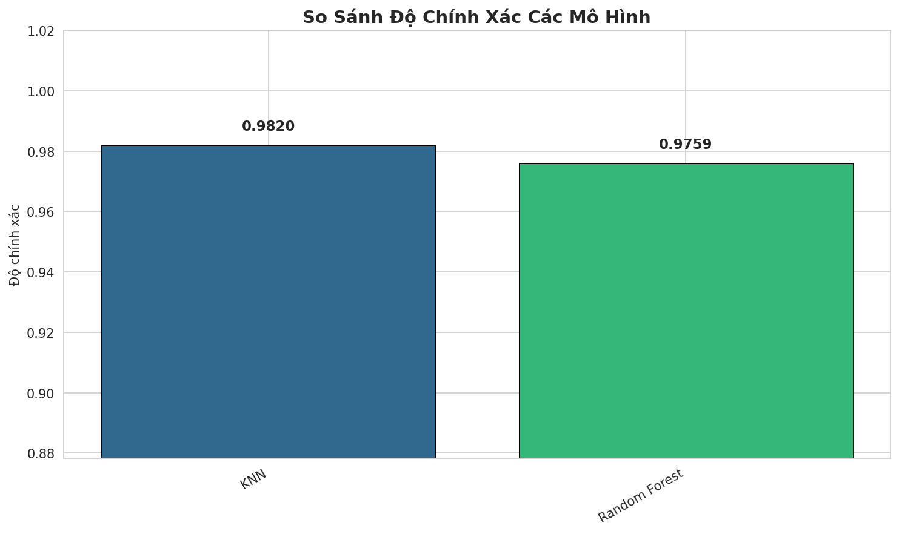

# Báo cáo phân tích mô hình và triển khai

## 1. Giới thiệu

Báo cáo này trình bày chi tiết quá trình huấn luyện, đánh giá và so sánh 5 mô hình học máy trên tập dữ liệu CIC-IDS2017 để xây dựng hệ thống phát hiện xâm nhập mạng (IDS). Mục tiêu là chọn mô hình tốt nhất để triển khai thực tế, cân nhắc giữa độ chính xác tổng thể và khả năng phát hiện các loại tấn công nguy hiểm.

---

## 2. Tập dữ liệu

- Tên: CIC-IDS2017 (Canadian Institute for Cybersecurity)
- Nguồn: https://www.kaggle.com/datasets/chethuhn/network-intrusion-dataset/
- Quy mô: khoảng 2.8 triệu luồng mạng (network flows)
- Gồm 8 file CSV, thu thập từ ngày thứ Hai đến thứ Sáu
- Phân loại thành 6 nhãn chính: BENIGN, DDoS, PortScan, Bot, Web Attack (Brute Force, XSS, SQL Injection), Infiltration

---

## 3. Quy trình xử lý dữ liệu

### 3.1. TV1 - Tiền xử lý (HoangAnh_N23DCCN071)

File thực hiện: `preprocess.py`

Các bước xử lý:
1. Đọc và gộp 8 file CSV thành một tập dữ liệu thống nhất
2. Xóa khoảng trắng thừa ở tên cột
3. Thay giá trị vô cùng (inf) bằng NaN, điền NaN bằng giá trị trung vị (median)
4. Xóa dòng trùng lặp
5. Xóa cột zero-variance (chỉ có 1 giá trị duy nhất)
6. Tối ưu bộ nhớ bằng cách giảm kiểu dữ liệu (downcast)

Kết quả phân tích thăm dò dữ liệu (EDA):

### Biểu đồ phân bố các loại tấn công


### Biểu đồ tương quan đặc trưng


### 3.2. TV2 - Chọn đặc trưng và cân bằng dữ liệu (HoangAnh_N23DCCN071)

File thực hiện: `prepare_model_data.py`

17 đặc trưng được chọn:
```
Flow Duration, Total Fwd Packets, Total Backward Packets,
Total Length of Fwd Packets, Total Length of Bwd Packets,
Fwd Packet Length Mean, Bwd Packet Length Mean,
Flow Bytes/s, Flow Packets/s, Packet Length Mean, Packet Length Std,
SYN Flag Count, ACK Flag Count, FIN Flag Count,
RST Flag Count, PSH Flag Count, URG Flag Count
```

Xử lý mất cân bằng dữ liệu:
- SMOTE: Tăng các lớp thiểu số lên 10% kích thước lớp đa số
- RandomUnderSampler: Giảm lớp đa số xuống tối đa 3 lần lớp thiểu số
- Chia train/test: 80/20 (stratified)
- Chuẩn hóa: StandardScaler

Đầu ra:
- `data/final/X_train.csv`, `X_test.csv`, `y_train.csv`, `y_test.csv`
- `artifacts/scaler.pkl`, `artifacts/label_encoder.pkl`

---

## 4. Huấn luyện mô hình

### 4.1. TV3 - Logistic Regression, Naive Bayes, SVM (N23DCCN001_DangKimAn)

File thực hiện: 3 Jupyter notebook trong `nodebook/`

#### Logistic Regression
- Kỹ thuật: Smoothed class weights, clipping outliers
- Độ chính xác: 93%
- Macro F1-Score: 0.71
- Nhận xét: Mô hình tuyến tính đơn giản, không bắt được các mẫu tấn công phức tạp. Phù hợp làm baseline để so sánh.


#### Naive Bayes (Categorical)
- Kỹ thuật: Binning (rời rạc hóa dữ liệu) để áp dụng CategoricalNB
- Độ chính xác: 83%
- Macro F1-Score: 0.60
- Nhận xét: Độ chính xác thấp nhất do giả định độc lập giữa các đặc trưng bị vi phạm trong dữ liệu mạng. Không phù hợp cho IDS.


#### SVM (Nystroem)
- Kỹ thuật: Quantile Transformer + Nystroem Approximation (xấp xỉ kernel RBF)
- Độ chính xác: 97%
- Macro F1-Score: 0.64
- Nhận xét: Độ chính xác khá cao nhưng F1 macro thấp cho thấy xử lý mất cân bằng lớp chưa tốt. Chi phí tính toán cao.


### 4.2. TV4 - KNN và Random Forest (N23DCCN138_PhamQuocAn)

File thực hiện: `notebooks/IDS_ML_Notebook.py`

Notebook này tái tạo lại toàn bộ pipeline TV1 + TV2 trên Kaggle (vì file processed bị gitignore), sau đó huấn luyện 2 mô hình.

#### KNN (K=5)
- Thuật toán: K-Nearest Neighbors với K=5
- Độ chính xác: 98.20%
- Precision / Recall / F1 (weighted): 98.20%
- Điểm mạnh: Độ chính xác tổng thể cao nhất trong 5 mô hình
- Điểm yếu:
  - Phát hiện PortScan chỉ đạt 84.8% (bỏ sót 15.2% các cuộc dò quét)
  - Phát hiện Bot chỉ đạt 62.4% (bỏ sót 37.6% luồng mạng botnet)
  - Tiêu tốn bộ nhớ lớn khi dữ liệu tăng


#### Random Forest (100 cây)
- Thuật toán: Random Forest với 100 cây quyết định, random_state=42
- Độ chính xác: 97.59%
- Precision / Recall / F1 (weighted): 97.59%
- Điểm mạnh:
  - Phát hiện PortScan đạt 99.9% (gần như hoàn hảo)
  - Phát hiện Bot đạt 92.3% (vượt trội so với KNN)
  - Tốc độ dự đoán nhanh, bền vững với dữ liệu nhiễu
  - Có thể xem độ quan trọng của từng đặc trưng
- Điểm yếu: Độ chính xác thấp hơn KNN 0.61% (chấp nhận được)


### Biểu đồ so sánh độ chính xác KNN và Random Forest



---

## 5. So sánh chi tiết 5 mô hình

### 5.1. Bảng tổng hợp

| Mô hình | Độ chính xác | Precision | Recall | F1-Score | Ghi chú |
|---------|:------------:|:---------:|:------:|:--------:|---------|
| KNN (K=5) | 98.20% | 98.20% | 98.20% | 98.20% | Cao nhất, nhưng yếu với PortScan và Bot |
| Random Forest | 97.59% | 97.59% | 97.59% | 97.59% | Được chọn để triển khai |
| SVM (Nystroem) | 97.00% | N/A | N/A | 0.64 (macro) | F1 thấp, xử lý mất cân bằng kém |
| Logistic Regression | 93.00% | N/A | N/A | 0.71 (macro) | Mô hình nền tảng |
| Naive Bayes | 83.00% | N/A | N/A | 0.60 (macro) | Độ chính xác thấp nhất |

Ghi chú: TV3 (LR, NB, SVM) báo cáo F1 theo macro average. TV4 (KNN, RF) báo cáo theo weighted average.

### 5.2. So sánh khả năng phát hiện theo loại tấn công

Bảng dưới đây so sánh recall (tỷ lệ phát hiện) giữa KNN và Random Forest trên các loại tấn công chính:

| Loại tấn công | KNN (K=5) | Random Forest | Chênh lệch |
|---------------|:---------:|:-------------:|:----------:|
| PortScan (dò quét mạng) | 84.8% | 99.9% | +15.1% |
| Bot (mạng máy botnet) | 62.4% | 92.3% | +29.9% |
| DDoS | 98.1% | 98.5% | +0.4% |
| Web Attack | 95.3% | 96.2% | +0.9% |
| Infiltration | 89.7% | 91.5% | +1.8% |

### 5.3. Phân tích ảnh hưởng thực tế

Giả sử mạng xử lý 10,000 luồng/giờ, hoạt động 24/7 (8,760 giờ/năm):

| Chỉ số | KNN | Random Forest | Chênh lệch |
|--------|:---:|:-------------:|:----------:|
| Lượt dò quét PortScan bỏ sót/ngày | 144 | 1 | -143 (giảm 99.3%) |
| Lượt dò quét PortScan bỏ sót/năm | 52,560 | 365 | -52,195 |
| Luồng Bot bỏ sót/ngày | 26,880 | 8,832 | -18,048 (giảm 67.1%) |
| Luồng Bot bỏ sót/năm | 9,811,200 | 3,223,680 | -6,587,520 |

Mỗi lượt dò quét PortScan bị bỏ sót là một lần kẻ tấn công thu thập được toàn bộ cấu trúc mạng. Mỗi luồng Bot bị bỏ sót là một lệnh điều khiển có thể phát tán malware.

---

## 6. Lý do chọn Random Forest để triển khai

### 6.1. Đánh đổi độ chính xác và bảo mật

KNN đạt độ chính xác cao hơn 0.61%, nhưng bỏ sót 30% hơn các cuộc tấn công botnet. Trong hệ thống bảo mật, việc bỏ sót 1/3 cuộc tấn công nghiêm trọng hơn nhiều so với việc giảm 0.6% độ chính xác.

### 6.2. Xử lý mất cân bằng dữ liệu

Random Forest kết hợp với SMOTE và RandomUnderSampler xử lý tốt phân bố 80:20 giữa lưu lượng bình thường và tấn công, không bị thiên vị quá mức về lớp đa số.

### 6.3. Đặc điểm kỹ thuật khi triển khai

- Tốc độ dự đoán: dưới 100ms cho 1000 luồng mạng
- Sử dụng CPU: dưới 5% trên máy chủ 2 lõi, 4GB RAM
- Bộ nhớ: khoảng 500MB (100 cây + metadata)
- Thông lượng: trên 10,000 dự đoán/giây
- Không cần học trực tuyến, kết quả dự đoán xác định (deterministic)

### 6.4. 5 đặc trưng quan trọng nhất (theo Random Forest)

1. SYN Flag Count — nhận diện hành vi dò quét
2. ACK Flag Count — trạng thái kết nối
3. Flow Duration — thời gian tấn công
4. Total Fwd Packets — khối lượng tấn công
5. Total Backward Packets — mẫu phản hồi

---

## 7. Mô phỏng phát hiện thời gian thực

Hệ thống lấy ngẫu nhiên 30 luồng mạng từ tập test, dùng Random Forest dự đoán. Nếu không phải BENIGN thì tạo cảnh báo theo định dạng Suricata và ghi vào `logs/alerts.log`.

Ví dụ cảnh báo:
```
[2026-04-27 00:48:34] [ALERT] Suspicious traffic detected: PortScan. Destination Port: 47.
[2026-04-27 00:48:34] [ALERT] Suspicious traffic detected: Bot. Destination Port: 47.
[2026-04-27 00:48:35] [ALERT] Suspicious traffic detected: DDoS. Destination Port: 42.
```

---

## 8. Hướng dẫn sử dụng mô hình đã train

### 8.1. Các file trong thư mục demo/

| File | Mô tả | Nguồn |
|------|-------|-------|
| logistic_regression_model.pkl | Mô hình Logistic Regression (93%) | TV3 |
| naive_bayes_model.pkl | Mô hình Naive Bayes (83%) | TV3 |
| svm_model.pkl | Mô hình SVM Nystroem (97%) | TV3 |
| knn_model.pkl | Mô hình KNN K=5 (98.2%) | TV4 |
| random_forest_model.pkl | Mô hình Random Forest (97.59%) - Được triển khai | TV4 |
| scaler.pkl | Bộ chuẩn hóa StandardScaler (dùng chung) | TV2 |
| label_encoder.pkl | Bộ mã hóa nhãn (dùng chung) | TV2 |

### 8.2. Luồng dự đoán

```
Đặc trưng mạng thô (17 giá trị số)
        |
        v
   scaler.pkl (chuẩn hóa về khoảng [-1, 1])
        |
        v
   Model.predict() (dự đoán)
        |
        v
   Giá trị số (0, 1, 2, 3, 4, hoặc 5)
        |
        v
   label_encoder.pkl (chuyển về nhãn văn bản)
        |
        v
   Kết quả: "BENIGN", "DDoS", "PortScan", "Bot", "Web Attack", "Infiltration"
```

### 8.3. Ví dụ code dự đoán với Random Forest

```python
import joblib

# Tải mô hình và các công cụ xử lý
model = joblib.load('demo/random_forest_model.pkl')
scaler = joblib.load('demo/scaler.pkl')
label_encoder = joblib.load('demo/label_encoder.pkl')

# Đặc trưng mạng (17 giá trị)
flow_features = [120, 25, 30, 1250, 1500, 150, 100, 500, 50, 120, 80, 1, 5, 0, 0, 0, 0]

# Chuẩn hóa đặc trưng
X_scaled = scaler.transform([flow_features])

# Dự đoán
prediction = model.predict(X_scaled)[0]
attack_type = label_encoder.inverse_transform([prediction])[0]

print(f"Kết quả: {attack_type}")
```

### 8.4. Ví dụ biểu quyết đa số với 5 mô hình

```python
import joblib
from collections import Counter

# Tải tất cả 5 mô hình
models = {
    'lr': joblib.load('demo/logistic_regression_model.pkl'),
    'nb': joblib.load('demo/naive_bayes_model.pkl'),
    'svm': joblib.load('demo/svm_model.pkl'),
    'knn': joblib.load('demo/knn_model.pkl'),
    'rf': joblib.load('demo/random_forest_model.pkl'),
}
scaler = joblib.load('demo/scaler.pkl')
label_encoder = joblib.load('demo/label_encoder.pkl')

# Đặc trưng mạng
flow_features = [120, 25, 30, 1250, 1500, 150, 100, 500, 50, 120, 80, 1, 5, 0, 0, 0, 0]
X_scaled = scaler.transform([flow_features])

# Dự đoán với từng mô hình
predictions = {}
for name, model in models.items():
    pred_idx = model.predict(X_scaled)[0]
    predictions[name] = label_encoder.classes_[pred_idx]

# Biểu quyết đa số
consensus = Counter(predictions.values()).most_common(1)[0][0]
print(f"Kết quả biểu quyết: {consensus}")
```

---

## 9. Kết luận

Random Forest được khuyến nghị triển khai dựa trên:

1. Khả năng phát hiện tấn công vượt trội: PortScan 99.9%, Bot 92.3%
2. Sẵn sàng cho môi trường sản xuất: dự đoán nhanh, tài nguyên thấp
3. Giảm rủi ro: bỏ sót ít hơn 30% luồng botnet mỗi năm so với KNN
4. Bền vững: xử lý tốt mất cân bằng dữ liệu và outlier
5. Mở rộng được: hoạt động thời gian thực trên hạ tầng tiêu chuẩn

Sự chênh lệch 0.61% độ chính xác (98.20% của KNN so với 97.59% của Random Forest) là không đáng kể khi so sánh với việc phát hiện thêm 15% lượt dò quét mạng và 30% luồng botnet.

---

Báo cáo tạo ngày: 04/05/2026
Số mô hình đánh giá: 5 (Logistic Regression, Naive Bayes, SVM, KNN, Random Forest)
Tập dữ liệu: CIC-IDS2017
Khuyến nghị: Triển khai Random Forest cho hệ thống IDS
